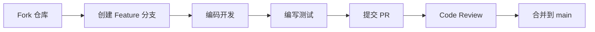

<p align="center">
  <a href="https://github.com/qoobots/openmall">
    
  </a>
  <a href="https://github.com/qoobots/openmall">
    
  </a>
  <a href="https://github.com/qoobots/openmall">
    
  </a>
  <a href="https://github.com/qoobots/openmall/blob/main/LICENSE">
    
  </a>
  <a href="https://github.com/qoobots/openmall">
    
  </a>
</p>

<h1 align="center">OpenMall</h1>

<p align="center">
  <strong>生产级 B2B2C 多商户电子商务平台</strong>
</p>

<p align="center">
  <a href="#-项目简介">项目简介</a> •
  <a href="#-核心特性">核心特性</a> •
  <a href="#-快速开始">快速开始</a> •
  <a href="#-技术架构">技术架构</a> •
  <a href="#-项目结构">项目结构</a> •
  <a href="#-文档导航">文档导航</a> •
  <a href="#-贡献指南">贡献指南</a> •
  <a href="#-许可证">许可证</a>
</p>

---

## 📖 项目简介

**OpenMall** 是一款基于 **Spring Boot 3.5.10 + JDK 21** 构建的开源 B2B2C 多商户电子商务平台，灵感源自天猫商城的商业模型。平台支持**平台运营方**统一管理、**多商家**入驻经营、**消费者**在线购物的一站式电商解决方案。

- **平台端 (Platform)**：商家审核、类目管理、系统配置、数据监控
- **商家端 (Merchant)**：店铺装修、商品管理、订单处理、营销活动、数据报表
- **买家端 (Portal)**：商品浏览与搜索、购物车、下单支付、用户中心、收藏与足迹

> **设计哲学**：前后端一体化 Thymeleaf 渲染，开箱即用，零前端构建工具依赖，适合中小团队快速搭建电商平台。

---

## ✨ 核心特性

### 业务能力

| 模块 | 功能 |
|------|------|
| **商品中心** | SPU/SKU 管理、多级分类、品牌管理、商品审核、库存管理 |
| **交易中心** | 购物车、下单、多种支付方式、订单生命周期管理、售后 |
| **营销中心** | 优惠券、满减满赠、限时折扣、秒杀、拼团 |
| **用户中心** | 注册登录、收货地址、收藏夹、浏览足迹、安全设置 |
| **店铺管理** | 店铺装修、店铺评分、商家认证、经营数据看板 |
| **平台运营** | 商家入驻审核、平台类目管理、系统配置、操作日志 |

### 技术亮点

- 🚀 **虚拟线程 (Virtual Threads)**：基于 JDK 21 Project Loom，大幅提升并发吞吐量
- 🔐 **Spring Security 6.2**：基于角色的细粒度权限控制 (RBAC)
- 📦 **多模块 Maven 工程**：`common-core` / `common-domain` / `common-security` / `common-web` 模块化拆分
- 🐳 **Docker 全容器化部署**：提供 Docker Compose 一键编排，含 Nginx 反向代理
- 🧩 **Thymeleaf 模板布局**：Fragment 布局复用，Bootstrap 5 响应式 UI
- 📊 **实时数据看板**：商家端与平台端数据统计大屏
- 🔄 **软删除 + 审计字段**：BaseEntity 统一 id / created_at / updated_at / deleted 字段

---

## ⚡ 快速开始

### 前置要求

| 依赖 | 最低版本 |
|------|----------|
| JDK | 21+ |
| Maven | 4.0.0+ |
| MySQL | 8.0+ |
| Redis | 6.0+ |

### 本地开发部署

```bash
# 1. 克隆仓库
git clone https://github.com/qoobots/openmall.git
cd openmall

# 2. 初始化数据库
mysql -u root -p < db/schema.sql

# 3. 编译项目
mvn clean install -DskipTests

# 4. 启动三个模块（分别打开终端）
# 买家端 :8081
cd openmall-portal && mvn spring-boot:run

# 商家端 :8082
cd openmall-merchant && mvn spring-boot:run

# 平台端 :8083
cd openmall-platform && mvn spring-boot:run
```

### Docker Compose 部署

```bash
cd docker
docker compose up -d
```

### 默认账户

| 角色 | 用户名 | 密码 |
|------|--------|------|
| 平台管理员 | `admin` | `admin123` |
| 测试商家 | `merchant1` | `admin123` |
| 测试买家 | `buyer1` | `admin123` |

### 访问地址

| 端 | 地址 |
|----|------|
| 🛒 买家端 | http://localhost:8081 |
| 🏪 商家端 | http://localhost:8082/merchant |
| ⚙️ 平台端 | http://localhost:8083/platform |

---

## 🏗 技术架构

```
┌─────────────────────────────────────────────────────────┐
│                       Nginx (反向代理)                     │
├──────────────┬──────────────────┬───────────────────────┤
│   Portal     │    Merchant      │       Platform        │
│   :8081      │    :8082         │       :8083           │
├──────────────┴──────────────────┴───────────────────────┤
│                  Spring Boot 3.5.10 + JDK 21             │
│  ┌──────────────────────────────────────────────────┐   │
│  │     Controller Layer (Spring MVC + Thymeleaf)     │   │
│  ├──────────────────────────────────────────────────┤   │
│  │           Service Layer (Business Logic)          │   │
│  ├──────────────────────────────────────────────────┤   │
│  │      Repository Layer (Spring Data JPA)           │   │
│  └──────────────────────────────────────────────────┘   │
├─────────────────────────┬───────────────────────────────┤
│      MySQL 8.0          │         Redis 6.0             │
│    (持久化存储)           │     (缓存 / 会话 / 分布式锁)    │
└─────────────────────────┴───────────────────────────────┘
```

### 技术选型

| 类别 | 技术 | 版本 |
|------|------|------|
| 基础框架 | Spring Boot | 3.5.10 |
| 安全框架 | Spring Security | 6.2.0 |
| ORM | Spring Data JPA + Hibernate | 6.x |
| 模板引擎 | Thymeleaf | 3.1.1 |
| 数据库 | MySQL | 8.0+ |
| 缓存 | Redis | 6.0+ |
| 前端UI | Bootstrap 5 + jQuery | 5.x / 3.6 |
| 工具库 | Lombok / Hutool / Apache Commons | 1.18 / 5.8 / 3.x |

---

## 📂 项目结构

```
openmall/
├── openmall-common/                 # 公共基础模块
│   ├── common-core/                 # 核心工具类、常量、枚举、异常定义
│   ├── common-domain/               # 通用领域实体 (BaseEntity, 14张表实体)
│   ├── common-security/             # 安全认证模块 (Spring Security 配置)
│   └── common-web/                  # Web 通用配置 (拦截器、过滤器、CORS)
│
├── openmall-portal/                 # 🛒 买家端 (前台商城)
│   ├── controller/                  # 首页、商品、购物车、订单、用户
│   ├── service/                     # 业务逻辑层
│   ├── repository/                  # JPA Repository 数据访问层
│   └── resources/
│       ├── templates/               # Thymeleaf 模板
│       └── static/                  # CSS / JS / 图片
│
├── openmall-merchant/               # 🏪 商家端 (商家后台)
│   ├── controller/                  # 商品管理、订单管理、店铺、营销
│   ├── service/
│   ├── repository/
│   └── resources/
│       ├── templates/
│       └── static/
│
├── openmall-platform/               # ⚙️ 平台端 (运营管理)
│   ├── controller/                  # 商家审核、用户管理、系统配置
│   ├── service/
│   ├── repository/
│   └── resources/
│       ├── templates/
│       └── static/
│
├── docker/                          # Docker 编排文件
│   ├── Dockerfile                   # 应用镜像
│   ├── docker-compose.yml           # 服务编排
│   └── deploy.sh / deploy.bat       # 一键部署脚本
│
├── db/                              # 数据库脚本
│   └── schema.sql                   # DDL 建表 + 初始化数据
│
├── docs/                            # 📚 项目文档 (详见文档导航)
│
├── pom.xml                          # 父 POM (依赖版本管理)
├── README.md                        # 本文件
├── LICENSE                          # Apache 2.0
└── .gitignore
```

---

## 📚 文档导航

完整文档位于 [`docs/`](docs/) 目录：

| 分类 | 文档 | 说明 |
|------|------|------|
| 🏗 **架构设计** | [系统架构设计](docs/architecture/01-系统架构设计.md) | 总体架构、技术选型、部署架构 |
| | [数据库设计](docs/architecture/02-数据库设计.md) | 14 张核心表、ER 图、索引策略 |
| | [接口设计规范](docs/architecture/03-接口设计规范.md) | 统一响应格式、API 清单、安全规范 |
| 🛠 **开发规范** | [编码规范](docs/development/01-编码规范.md) | 命名、分层、异常、日志、测试规范 |
| | [贡献指南](docs/development/02-贡献指南.md) | PR 流程、Commit 规范、代码审查 |
| | [安全策略](docs/development/03-安全策略.md) | 认证、接口、数据、部署安全 |
| | [Git 工作流](docs/development/04-Git工作流规范.md) | 分支模型、Tag 规范、发版流程 |
| 🚀 **部署运维** | [部署指南](docs/deployment/01-部署指南.md) | JAR / Docker / Compose 部署 |
| | [运维手册](docs/deployment/02-运维手册.md) | 日常运维、备份恢复、故障处理 |
| | [构建指南](docs/deployment/BUILD_GUIDE.md) | Maven 构建配置说明 |
| 📖 **用户指南** | [用户操作手册](docs/user-guide/01-用户操作手册.md) | 三端操作说明 |
| | [API 接口文档](docs/user-guide/02-API接口文档.md) | RESTful API 参考 |
| | [常见问题 FAQ](docs/user-guide/03-常见问题FAQ.md) | 环境、功能、开发、部署 FAQ |
| 📋 **项目管理** | [项目概览](docs/project-management/PROJECT_OVERVIEW.md) | 项目全景说明 |
| | [功能清单](docs/project-management/01-功能清单完成进度.md) | 功能完成度追踪 |
| | [变更日志](docs/project-management/02-变更日志.md) | 版本变更记录 |
| | [发布计划](docs/project-management/03-版本发布计划.md) | 版本路线图 |

---

## 🤝 贡献指南

我们欢迎任何形式的贡献！请阅读 [贡献指南](docs/development/02-贡献指南.md) 了解如何参与。

### 贡献流程



### Commit 规范

本项目遵循 [Conventional Commits](https://www.conventionalcommits.org/) 规范：

```
feat:     新功能
fix:      Bug 修复
docs:     文档变更
style:    代码格式（不影响功能）
refactor: 重构
perf:     性能优化
test:     测试相关
chore:    构建/工具变更
```

### 行为准则

请遵守我们的 [行为准则](CODE_OF_CONDUCT.md)，共同维护友好、包容的开源社区。

---

## 🔒 安全

发现安全漏洞请**不要**提交公开 Issue，请发送邮件至 `security@openmall.com`。详见 [安全策略](docs/development/03-安全策略.md)。

---

## 📄 许可证

本项目基于 [Apache License 2.0](LICENSE) 开源。

```
Copyright 2024-2026 OpenMall Contributors

Licensed under the Apache License, Version 2.0 (the "License");
you may not use this file except in compliance with the License.
You may obtain a copy of the License at

    http://www.apache.org/licenses/LICENSE-2.0

Unless required by applicable law or agreed to in writing, software
distributed under the License is distributed on an "AS IS" BASIS,
WITHOUT WARRANTIES OR CONDITIONS OF ANY KIND, either express or implied.
See the License for the specific language governing permissions and
limitations under the License.
```

---

## 👥 核心团队

OpenMall 由 [@qoobots](https://github.com/qoobots) 创建并维护。

### 贡献者

感谢所有为本项目做出贡献的开发者！

<a href="https://github.com/qoobots/openmall/graphs/contributors">
  
</a>

---

## ⭐ Star 历史

[](https://star-history.com/#qoobots/openmall&Date)

---

<p align="center">
  <sub>Built with ❤️ by the OpenMall Team | &copy; 2024-2026 OpenMall</sub>
</p>
